<div align="center">


<a href="https://github.com/Soham-Patil10">
  
</a>

<br/>


<br/><br/>

<a href="https://linkedin.com/in/soham-patil-978949274">
  
</a>
<a href="mailto:sohampatil2016@gmail.com">
  
</a>
<a href="https://github.com/Soham-Patil10">
  
</a>

<br/><br/>


</div>

---

## 🧬 About Me

I'm a Computer Science graduate student at **University College Dublin** (Negotiated Learning track), with a B.Tech in Artificial Intelligence and hands-on experience spanning **full-stack engineering, applied machine learning, and AI security**. My work bridges robust software engineering practice with research-grade AI, from shipping production REST APIs during a software engineering internship to leading a six-person team building an adversarial-robustness benchmarking platform for computer vision systems.

I approach engineering with a **product mindset**: clean architecture, reproducible pipelines, and systems that hold up under real-world (and adversarial) conditions, not just notebooks that work once.

<table align="center">
<tr>
<td>

**🎯 Open To**
- Software Engineering roles (Full-Stack / Backend)
- AI / ML Engineering & MLOps roles
- Applied Research internships in Trustworthy / Adversarial ML
- Collaborative open-source contributions

</td>
</tr>
</table>

---

## 🛠️ Tech Stack

**Languages**
<p>  </p>

**Frontend**
<p>  </p>

**Backend & Databases**
<p>  </p>

**AI / ML & Data**
<p>  </p>

**Cloud, DevOps & Tooling**
<p>  </p>

---

## 💼 Experience

### Software Development Intern
**Maverik HCM** · *January 2025 – June 2025*

Contributed to the FuelEU web application, completing 40+ tasks spanning frontend, backend, and database modules in a professional agile environment.

- Built responsive UI components using **Angular**
- Developed RESTful APIs for authentication and user management using **Spring Boot**
- Collaborated within an agile team workflow using **Git** for version control
- Strengthened full-stack development practices across the application lifecycle

`Angular` `Spring Boot` `REST APIs` `Git` `Agile` `Full-Stack Development`

---


## 📜 Certifications

<!-- TODO: Add your real certification badges below, grouped by provider -->

**AWS**
<p><i>To be added.</i></p>

**Udemy**
<p><i>To be added.</i></p>

---

## 💻 Coding Profiles

<!-- TODO: replace placeholder usernames with your real handles -->
<div align="center">

<a href="https://leetcode.com/u/Soham-Patil/">
  
</a>

</div>

---

## 📊 GitHub Analytics

<div align="center">




<br/>



</div>

---

## 📈 Contribution Activity

<div align="center">


</div>

---

## 🐍 Contribution Snake

<div align="center">

<picture>
  <source media="(prefers-color-scheme: dark)" srcset="https://raw.githubusercontent.com/Soham-Patil10/Soham-Patil10/output/github-snake-dark.svg" />
  <source media="(prefers-color-scheme: light)" srcset="https://raw.githubusercontent.com/Soham-Patil10/Soham-Patil10/output/github-snake.svg" />
  
</picture>

</div>

---

## 🔭 Current Focus

```yaml
Learning:
  - Cloud fundamentals (AWS)
  - Advanced adversarial machine learning techniques

Building:
  - "TrafficGuard: adversarial robustness dashboard for traffic-congestion AI"

Exploring:
  - MLOps pipelines
  - Generative AI / LLM application development

Open To:
  - Software Engineering Internships & Full-Time Roles
  - AI / ML Engineering opportunities
```

---

## 📫 Connect With Me

<div align="center">

<a href="mailto:sohampatil2016@gmail.com">
  
</a>
<a href="https://linkedin.com/in/soham-patil-978949274">
  
</a>
<a href="https://github.com/Soham-Patil10">
  
</a>

</div>

---

<div align="center">

<i>"Greatness from small beginnings."</i>


</div>
